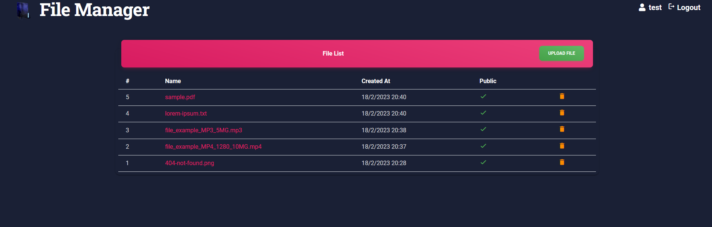

# File Manager

A web-app to store & share files with your friends online for free! The backend is built using typescript & AdonisJs and edge templating is used for frontend.



### Features

- Allows new users to signup so that they can share files
- Allows users to upload files & generate a public shareable link
- Allows user to control whether an uploaded file is public or not
- Allows users to preview the files before downloading them

### Tech Stack

- AdonisJS as the core framework for development
- Postgres Database for storing user & file data
- Linode Object Storage for storing actual files (but any s3 compatible object storage can be used)

## How to run it locally?

### Prerequisites

- Node - v16.15.0
- Yarn - v1.22.18
- Postgres Database
- AWS S3 compatible storage

### Local installation

- Install the dependencies

```bash
yarn install
```

- Copy & Fill environment variables

```bash
# copy file and set proper data inside
cp .env.example .env
```

- Migrate database

```bash
node ace migration:run
```

- Run Server

```bash
yarn dev
```

## Making build

```bash
yarn build
```
